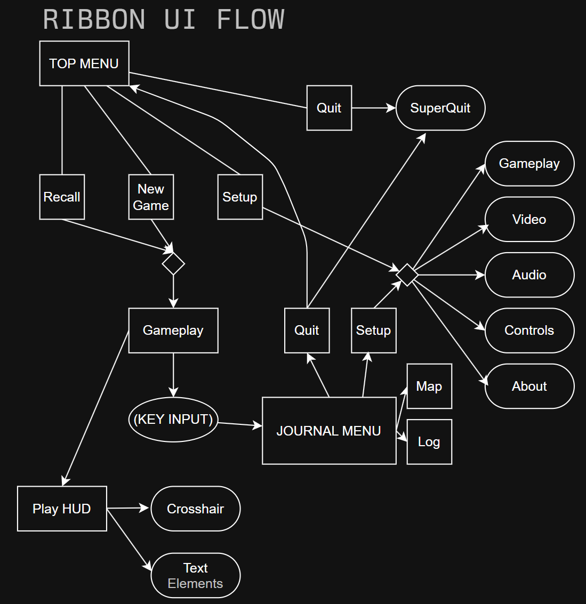

# RIBBON

* Reach each tower

# Variables

|   Type|Var Name|Details|
|   -|-|-  
|   -   |   -   |   -

# Level Generation

* Pack - do everything to pack the player up for the next level
* Seed generation - store a seed based on current level to influence next level
* Terrain generation - build hills, vertices, etc
* Indice generation - pick coordinates on terrain, store to an index
* Structure generation - place gateway in middle-most average point, spawn towers at the rest
* Solvable generation - create a solution and distribute across towers
* Solution (Rune) generation - replace one of the towers with a solution rune
* Unpack - do everything to make the player actor ready to go

# Music Generation

# User Interface Hierachies

This details the progression/adjacency of UI and modal elements, how they connect:

[Diagram](userinterface.drawio)

- Player HUD
  - Active ELEMENT
    - Crosshair ELEMENT
  
- Activity WINDOW
  - Rune MODAL
    - D
  - Journal MODAL
    - Log MODAL
      - Save MODAL
      - Load MODAL
    - Map MODAL
    - Settings MODAL
      - Quit MODAL
        - Quit to Menu
        - SuperQuit ACTION

- Main Menu HUD
  - *(First time?)*
    - **JUMP TO** -> Settings MODAL
  - Ignition MODAL
  - Settings MODAL
  - Quit MODAL
    - SuperQuit ACTION

- Quit MODAL
  - Quit to Menu
  - Superquit (Exits the game)